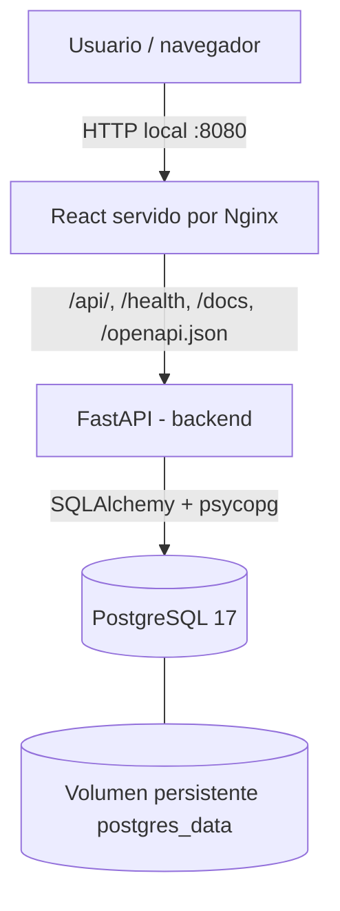
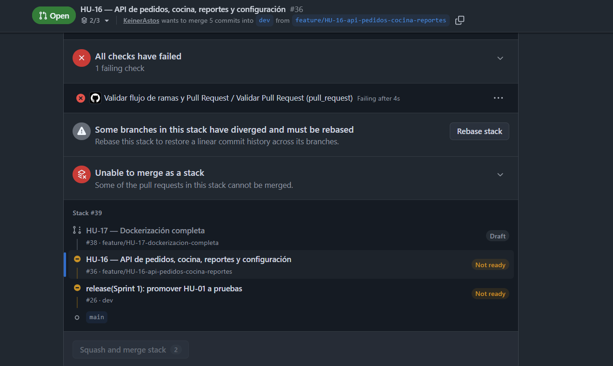
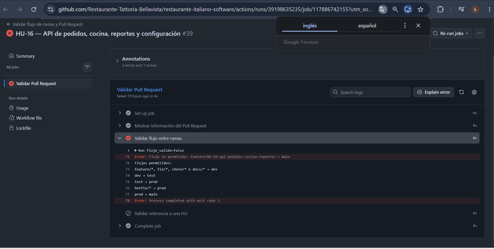
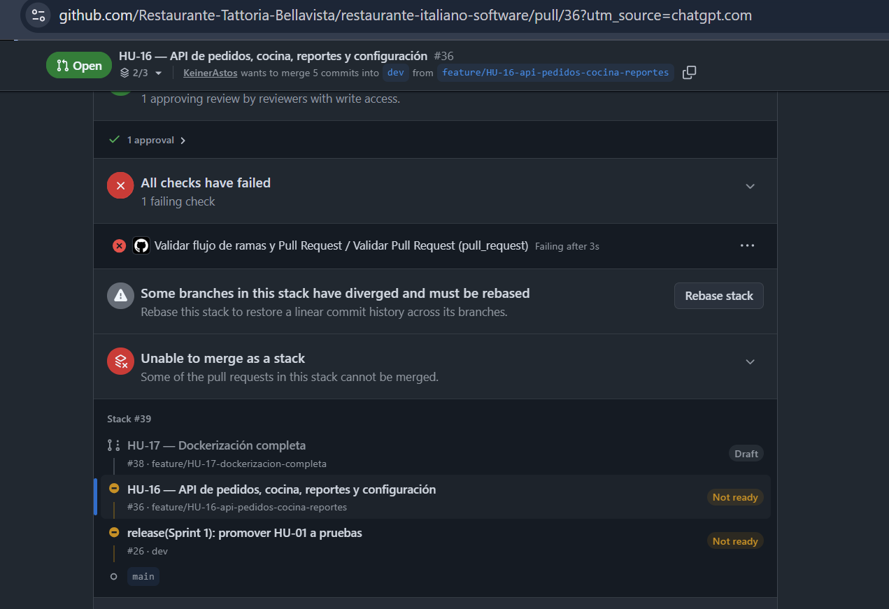
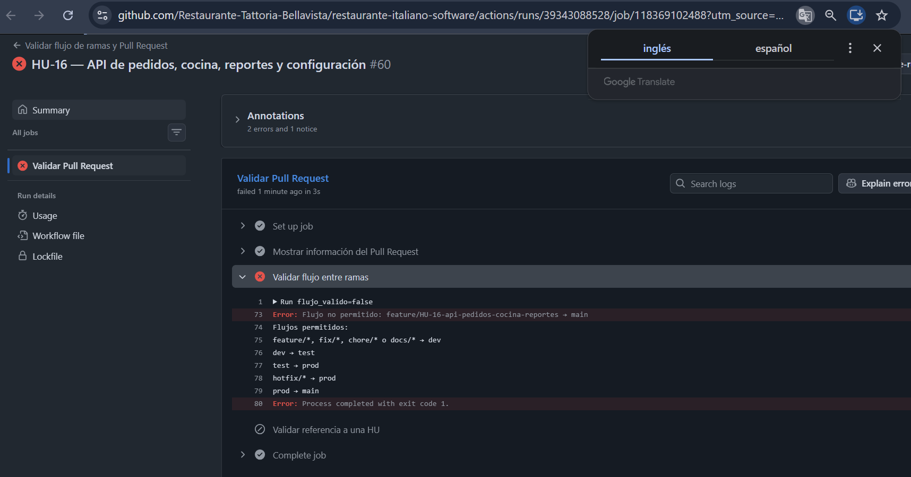
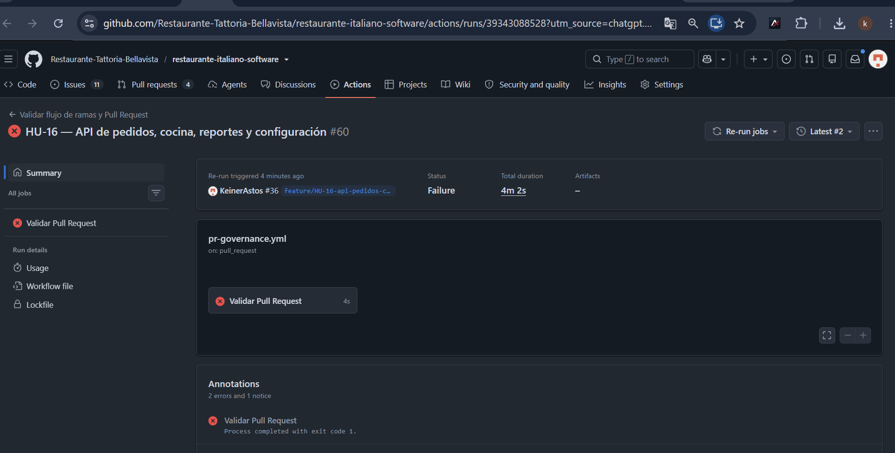
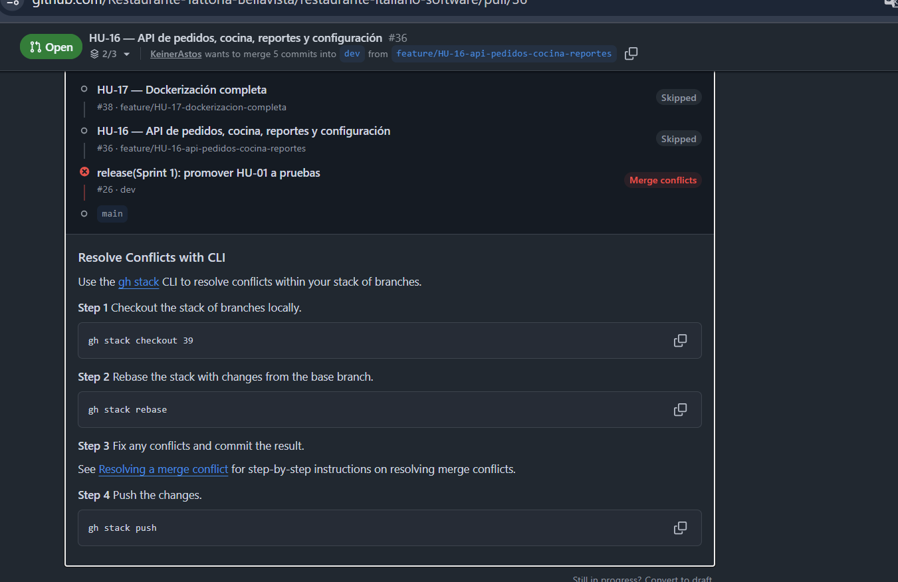

# Trattoria Bellavista — Sistema de gestión para restaurante italiano

> **Proyecto académico colaborativo** · React + Nginx · FastAPI · PostgreSQL 17 · Docker Compose
> **Última revisión documental:** 23 de octubre de 2026. Este README distingue entre capacidades implementadas, comprobaciones realizadas y pendientes de despliegue.

## 1. Descripción y alcance

Trattoria Bellavista es una aplicación para apoyar la gestión operativa de un restaurante: mesas y distribución física (*layout*), catálogo de productos, clientes, reservas, pedidos, estados de cocina, reportes y configuración. La solución organiza su backend como un **monolito modular FastAPI**; la separación por routers, esquemas, modelos y acceso a datos facilita su mantenimiento y posible evolución a servicios independientes.

**Equipo académico:** Keiner, Alejandra y Fernando. Las asignaciones de implementación por historia deben consultarse en GitHub Projects y en las issues correspondientes; no debe confundirse el responsable de Docker con la autoría exclusiva del backend o frontend.

**Repositorio:** [Restaurante-Tattoria-Bellavista/restaurante-italiano-software](https://github.com/Restaurante-Tattoria-Bellavista/restaurante-italiano-software).

## 2. Arquitectura


```mermaid
flowchart TD
    U[Usuario / navegador] -->|HTTP local :8080| N[React servido por Nginx]
    N -->|/api/, /health, /docs, /openapi.json| A[FastAPI - backend]
    A -->|SQLAlchemy + psycopg| D[(PostgreSQL 17)]
    D --- V[(Volumen persistente postgres_data)]
```

| Capa | Tecnología / función |
|---|---|
| Interfaz | React, Vite; archivos estáticos servidos por Nginx |
| API | Python 3.12, FastAPI y Uvicorn; routers de catálogo, reservas, operación y salud |
| Persistencia | PostgreSQL 17, SQLAlchemy 2, psycopg 3; inicialización SQL en volumen nuevo |
| Empaquetado | Dockerfiles para frontend y backend; `docker-compose.yml` con tres servicios |
| Red local | Servicios `frontend`, `backend` y `db` en red Compose `internal` |
| Exposición local | El frontend publica `FRONTEND_PORT` (predeterminado `8080`); backend y BD **no** publican puertos del host en el Compose revisado |

### Estructura relevante

```text
backend/
  app/
    main.py
    routers/{health,catalogo,reservas,operacion}.py
    models/  schemas/  db/  core/
  tests/
  Dockerfile
  requirements.txt
frontend-react/
  Dockerfile
  nginx.conf
  package.json
docker/postgres/01-schema.sql
docker-compose.yml
.env.docker.example
README.md
docs/images/incidencias/
```

## 3. Funcionalidades y API

Todas las rutas de negocio revisadas usan prefijo `/api/v1`. La referencia de contrato, parámetros y modelos se puede consultar en **`http://localhost:8080/docs`** cuando Docker está levantado.

| Módulo | Ejemplos de endpoints / acciones |
|---|---|
| Mesas y distribución | `GET/POST /api/v1/mesas`, `GET/PATCH /api/v1/mesas/{id}`, `GET/PUT /api/v1/mesas/{id}/layout` |
| Productos | `GET/POST /api/v1/productos`, `GET/PATCH /api/v1/productos/{id}` |
| Clientes | `GET/POST /api/v1/clientes`, `GET/PATCH /api/v1/clientes/{id}` |
| Reservas | `GET/POST /api/v1/reservas`, actualización y transición de estado de reservas |
| Pedidos | `GET/POST /api/v1/pedidos`, detalles de pedido, actualización, eliminación y transición de estado |
| Cocina | `GET /api/v1/cocina` |
| Reportes | `GET /api/v1/reportes/dashboard`, `GET /api/v1/reportes/productos` |
| Configuración | `GET/PATCH /api/v1/configuracion` |
| Salud | `GET /health`, `GET /health/db` |

**Reglas de negocio implementadas en el código revisado:** restricción de reservas solapadas por mesa en ventana de dos horas; validación de capacidad y estado de mesa; un pedido activo por mesa; cálculo de subtotal y total en servidor; transiciones controladas de estado de pedido; liberación de mesa al pagar o cancelar según corresponda. Estas reglas deben verificarse con las pruebas actuales y la demostración funcional, no inferirse únicamente de la respuesta HTTP 200 del frontend.

## 4. Instalación y despliegue local con Docker (Windows / Linux)

### Prerrequisitos

- Git, Docker Engine y Docker Compose; en Windows, Docker Desktop con backend Linux y WSL 2 funcional.
- Puerto configurable del frontend disponible (predeterminado `8080`).
- Permisos para construir imágenes y disponer de espacio para PostgreSQL.

### 4.1 Obtener código y configurar credenciales

```bash
git clone https://github.com/Restaurante-Tattoria-Bellavista/restaurante-italiano-software.git
cd restaurante-italiano-software
git switch dev
cp .env.docker.example .env  # En PowerShell: Copy-Item .env.docker.example .env
```

**Editar el `.env` local y reemplazar obligatoriamente `CAMBIAR_PASSWORD`** por una contraseña fuerte alfanumérica. No publicar `.env`, credenciales ni salidas de `docker compose config` que expongan secretos. El ejemplo actual utiliza contraseña alfanumérica porque se inserta directamente en una URI de PostgreSQL; si se permiten símbolos, deben escaparse correctamente o modificarse la construcción de la URL.

```dotenv
# EJEMPLO DE FORMATO; nunca usar este valor como contraseña real
POSTGRES_PASSWORD=CAMBIAR_PASSWORD
FRONTEND_PORT=8080
```

### 4.2 Construir y ejecutar

```bash
docker compose config --quiet
docker compose up -d --build
docker compose ps
```

Compruebe que `db`, `backend` y `frontend` estén `healthy` antes de la demostración. Si `up` falla, consultar primero los logs; no borrar volúmenes por defecto.

### 4.3 Comprobar servicios

```bash
# Frontend: http://localhost:8080
# Documentación API: http://localhost:8080/docs
# Esquema OpenAPI: http://localhost:8080/openapi.json
# API a través de proxy:
curl -i http://localhost:8080/health
curl -i http://localhost:8080/health/db

docker compose ps
docker compose logs --tail=80 backend
docker compose logs --tail=80 frontend
```

En PowerShell puede usarse `Invoke-WebRequest -UseBasicParsing` en lugar de `curl`. `docker compose exec -T db pg_isready -U restaurant -d restaurant` comprueba la disponibilidad de PostgreSQL (no demuestra por sí solo que FastAPI puede autenticarse).

### 4.4 Ciclo de vida y preservación de datos

```bash
docker compose stop          # Pausa los contenedores sin borrar el volumen
docker compose start         # Vuelve a iniciarlos
docker compose up -d --build # Actualiza servicios según Compose
```

**No ejecutar `docker compose down -v` durante diagnóstico o actualización:** elimina los volúmenes gestionados y puede destruir los datos. El script `01-schema.sql` se aplica durante la inicialización de un directorio de PostgreSQL nuevo; **no** funciona como mecanismo automático de migración de una base persistente ya existente.

## 5. Despliegue en nube — procedimiento propuesto, NO certificado

**Estado:** el equipo certificó en un equipo Windows el despliegue *local* de Docker; no se dispone en estas evidencias de URL pública, dominio, proveedor ni infraestructura de producción en la nube. Esta sección es una **guía operativa para realizar el despliegue**, no una afirmación de que ya está publicado.

1. Elegir proveedor y entorno (VM Linux compatible con Docker Compose o servicio administrado equivalente). Dimensionar recursos, accesos y copias de seguridad.
2. Aprovisionar host, habilitar Docker y Compose y obtener el código desde una referencia revisada (rama/tag/commit aprobado).
3. Crear `.env` **solo en el servidor**, con secretos robustos y acceso restringido. No copiar contraseñas desde capturas ni del repositorio.
4. Configurar un proxy público con HTTPS/TLS, dominio y certificados válidos. Preferir exponer solo `443/80` mediante reverse proxy; **no exponer PostgreSQL ni FastAPI** directamente a Internet. El Compose actual publica `8080` HTTP y **no incluye TLS**, por lo que requiere adecuación previa a uso público.
5. Configurar persistencia de PostgreSQL en almacenamiento fiable, respaldo automatizado (por ejemplo `pg_dump` con retención), prueba real de restauración y monitoreo de uso de disco.
6. Definir procedimiento de despliegue: respaldo previo, `docker compose config --quiet`, `docker compose up -d --build`, salud y pruebas E2E; rollback de imágenes/configuración ante fallos.
7. Probar desde fuera de la red: web, `/docs` si se permite en producción, flujo de API, conectividad a BD, encabezados seguros, expiración TLS y persistencia después de reinicio.
8. Registrar URL, fecha, versión/commit, responsable, evidencia, plan de recuperación y resultado de las pruebas. **No declarar «desplegado en nube» hasta completarlo.**

> Nota: para producción se recomienda gestionar secretos con un gestor seguro, restringir `/docs` si corresponde y usar PostgreSQL administrado o reforzar el respaldo y seguridad del contenedor. Es una recomendación operativa, no una característica ya implementada.

## 6. Validación registrada — 23/10/2026

| Verificación local | Evidencia / resultado |
|---|---|
| `docker compose config --quiet` | OK tras crear `.env` |
| `docker compose up -d --build` | Imágenes construidas; inicialmente bloqueado por backend `unhealthy` |
| PostgreSQL `pg_isready` | Acepta conexiones |
| PostgreSQL directo `SELECT 1` | Devuelve `1` |
| SQLAlchemy desde FastAPI `SELECT 1` | Devuelve `1` tras sincronizar contraseña |
| FastAPI `/health` y `/health/db` | Ambos HTTP 200 tras corrección |
| Docker Compose `ps` | Backend y BD `healthy`; frontend confirmado `healthy` en comprobación previa al reinicio de Nginx |
| `GET /` vía `localhost:8080` | HTTP 200 |
| `GET /openapi.json` vía `localhost:8080` | HTTP 502 inicialmente; HTTP 200 tras reiniciar únicamente frontend |
| OpenAPI programático | Se informó `21` paths en la sesión de prueba |
| Pruebas completas de negocio en el despliegue actual | **No hay ejecución integral registrada en esta sesión**; pendiente |

Las comprobaciones anteriores corresponden al entorno local probado, no a producción en nube. Los *healthchecks* no sustituyen pruebas de flujo real ni pruebas de seguridad.

## 7. GitHub y estrategia de ramas

Flujo de promoción configurado en `pr-governance.yml`:

```text
feature/*, fix/*, chore/*, docs/* -> dev
                                  dev -> test
                                 test -> prod
                              prod -> main
                             hotfix/* -> prod
```

PR revisados: [HU-13 #33](https://github.com/Restaurante-Tattoria-Bellavista/restaurante-italiano-software/pull/33), [HU-14 #34](https://github.com/Restaurante-Tattoria-Bellavista/restaurante-italiano-software/pull/34), [HU-15 #35](https://github.com/Restaurante-Tattoria-Bellavista/restaurante-italiano-software/pull/35), [HU-16 #36](https://github.com/Restaurante-Tattoria-Bellavista/restaurante-italiano-software/pull/36) y [HU-17 #38](https://github.com/Restaurante-Tattoria-Bellavista/restaurante-italiano-software/pull/38).

**Estado verificado el 23/10/2026:** HU-13, HU-14, HU-15 y HU-16 fusionadas hacia `dev`; HU-17 se fusionó primero hacia la rama de HU-16 y sus cambios se incorporaron a `dev` al fusionar HU-16. El PR [#26](https://github.com/Restaurante-Tattoria-Bellavista/restaurante-italiano-software/pull/26) quedó fusionado de `dev` a `main` aunque su descripción mencionaba promoción a `test`; eso debe documentarse como desviación del flujo, no como procedimiento recomendado. Al revisar el PR [#52](https://github.com/Restaurante-Tattoria-Bellavista/restaurante-italiano-software/pull/52) de `dev` a `test`, aparecía **abierto con conflictos**: estado temporal sujeto a revalidación.

## 8. Bitácora de incidentes y resolución

Estos incidentes proceden de las evidencias compartidas durante la certificación. Las capturas ilustran los fallos **en el momento en que ocurrieron**; no representan necesariamente el estado actual del repositorio.

| ID | Síntoma y diagnóstico | Acción / resolución | Estado documentado |
|---|---|---|---|
| INC-01 | PR #36 aprobado pero check `Validar Pull Request` fallido y stack divergente | Revisar ramas, `merge-base` y log del workflow; se evitó rebase masivo | **Resuelto por integración posterior** de #36; check histórico fallido |
| INC-02 | Workflow evaluaba `feature/HU-16... → main` pese a que el PR visible tenía base `dev` | Confirmar evento y logs del job; no forzar merge por check inválido; PR #36 finalmente fusionado | **Histórico; comportamiento exacto del evento sin causa raíz confirmada** |
| INC-03 | Stack #39 indicaba conflictos en PR #26 (`dev` → `main`) | Tratar conflicto como independiente de HU-16; no ejecutar `gh stack rebase` ciegamente | PR #26 posteriormente fusionado; resolución detallada no documentada |
| INC-04 | `docker compose` rechazaba configuración por falta de `POSTGRES_PASSWORD` | Crear `.env` local a partir de plantilla, contraseña robusta; `compose config --quiet` OK | Resuelto |
| INC-05 | Docker Engine no respondía por `dockerDesktopLinuxEngine`; WSL `docker-desktop` detenida | Iniciar Docker Desktop y verificar `docker version`, WSL 2 y contexto `desktop-linux` | Resuelto |
| INC-06 | Backend iniciaba pero `GET /health/db` devolvía HTTP 503; `unhealthy` | Verificar red TCP y `SELECT 1`; identificar `password authentication failed` | Causa identificada |
| INC-07 | Contraseña nueva de `.env` no coincidía con la credencial del usuario PostgreSQL ya persistido | `ALTER ROLE restaurant WITH PASSWORD ...` sin borrar volumen; SQLAlchemy `SELECT 1` y ambos health HTTP 200 | Resuelto en laboratorio |
| INC-08 | Nginx devolvía HTTP 502 en `/openapi.json` aunque el backend devolvía HTTP 200 internamente | `docker compose restart frontend` exclusivamente; proxy respondió HTTP 200 | Resuelto en laboratorio; probable resolución DNS/upstream desactualizada, no demostrada en profundidad |
| INC-09 | `git branch` y worktrees: HU-16 local detrás del remoto; worktrees `detached HEAD` | Inspección no destructiva; no usar `reset --hard` ni `force push` | Evidencia histórica; revisar entorno local antes de manipularlo |
| INC-10 | Despliegue en nube y pruebas E2E completas | Aplicar sección 5, registrar versión y pruebas | **Pendiente** |

### INC-01 — Check fallido y stack divergente



### INC-02 — El workflow recibe una base incorrecta









### INC-03 — Conflicto de promoción / stack



### INC-04 a INC-08 — Evidencia técnica de Docker

Las siguientes salidas proceden de la consola utilizada en la certificación y se resumen sin datos secretos:

```text
# Falta configuración
required variable POSTGRES_PASSWORD is missing a value

# Motor Docker no disponible inicialmente
failed to connect to the docker API at npipe:////./pipe/dockerDesktopLinuxEngine

# Fallo de autenticación
FATAL: password authentication failed for user "restaurant"
GET /health/db HTTP/1.1 -> 503

# Corrección de credencial (sin borrar datos)
BACKEND_DB_SELECT1= 1
/health HTTP 200
/health/db HTTP 200
backend: healthy
db: healthy

# Proxy Nginx
GET /openapi.json -> HTTP 502
reinicio exclusivo de frontend
GET /openapi.json -> HTTP 200
```

**Lecciones:** una BD `healthy` no garantiza autenticación del backend; `pg_isready` no valida una contraseña remota; cambiar `.env` **no** cambia la contraseña de un rol de PostgreSQL ya inicializado; un proxy Nginx persistente puede requerir reinicio al cambiar su upstream; releer el detalle de cada check CI antes de modificar código o rebasar ramas.

## 9. Pruebas recomendadas antes de liberar versión

- Ejecutar pruebas del backend desde entorno controlado (por ejemplo `python -m pytest backend/tests -q`, con dependencias y configuración adecuadas).
- Ejecutar `npm ci`, `npm run lint` y `npm run build` desde `frontend-react/`.
- Verificar con datos de prueba altas/ediciones de mesas, productos, clientes, reservas, pedidos y transiciones de cocina, incluidos los códigos 400/404/409/422 esperados por contrato.
- Probar persistencia de PostgreSQL tras **reinicio no destructivo**; verificar respaldo y restauración antes de nube.
- Registrar evidencia de PR/checks verdes y de promoción `dev → test → prod → main`.

## 10. Pendientes y criterios de cierre

| Pendiente | Criterio de cierre |
|---|---|
| Promoción `dev → test` | PR #52 sin conflictos, checks obligatorios correctos y revisión aprobada |
| Calidad E2E | Pruebas de operaciones y UI documentadas sobre un commit identificable |
| Seguridad para nube | HTTPS, secretos seguros, exposición de puertos mínima y respaldo restaurable |
| Despliegue público | URL pública verificada desde otra red, salud, operaciones y versión publicada |
| Documentación visual adicional | Capturas de interfaz, Docker Healthy y flujos funcionales sin datos privados |

## 11. Seguridad de las evidencias

Las imágenes que acompañan este README provienen de capturas del historial de incidencias. No agregar capturas de `.env`, tokens, contraseñas, direcciones privadas, datos de clientes ni datos productivos. Las capturas de GitHub muestran referencias públicas a PR y workflows. Las imágenes se deben versionar junto con el README en las rutas relativas indicadas.

---

*Documentación elaborada a partir del código revisado en `dev`, las respuestas observadas durante la certificación local y el historial de PR. Una funcionalidad descrita en código no sustituye su prueba E2E.*
